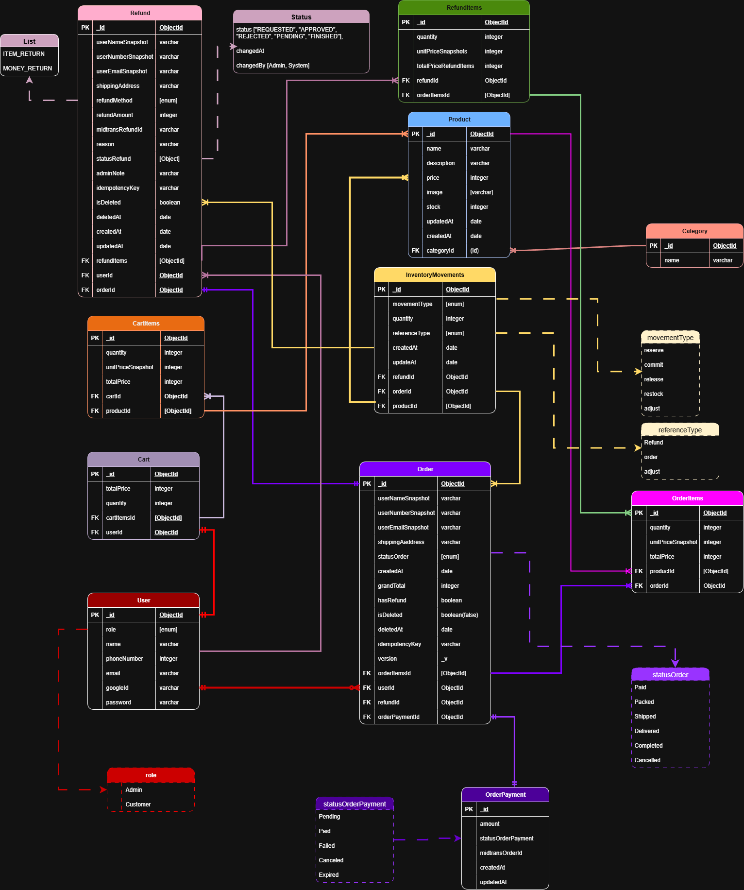

# Era Digital Meluas

### Tech stack
Frontend: React + Vite
Backend: Node.js + Express
Database: MongoDB with Mongoose
Auth: JWT
File Storage: Cloudinary
Extras: Multer, Bcrypt, Dotenv, CORS

## ERD


## Features

#### User
* Sign up and Login
* Change email, phone number, and password
* Delete their account
* Browse and filter products by category
* Product detail pages with images and info
* Shopping cart (auto expires after 30 days)
* Checkout with shipping and payment
* See order history and order detail
* Request a refund

#### Administrator
- Dashboard overview with quick stats
- Product management (create, update, delete)
- Category management (create, update, delete)
- Order management (view, update status)
- Refund management (approve or reject requests)

## Run the Project
##### 1. Clone the project
`git clone https://github.com/Bisnis-Adviz-Solusi/EDMCam.git
`
<br>

##### 2. Backend setup

* `cd backend`

* Create .env file
``` 
MONGO_URI=
JWT_SECRET=
CLOUDINARY_URL=
```

* Install and run
```
npm install
npm run dev
```
<br>

##### 3. Frontend setup

```
cd frontend
npm install
npm run dev
```

## Contributor

[Luh Made Ayu Tasya Devi Pratisthita](https://github.com/madetasya)